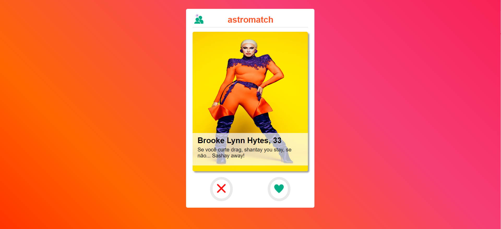
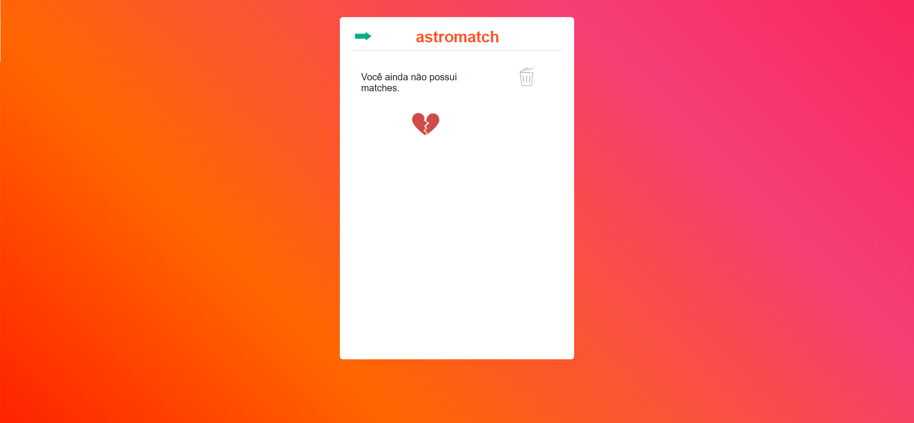
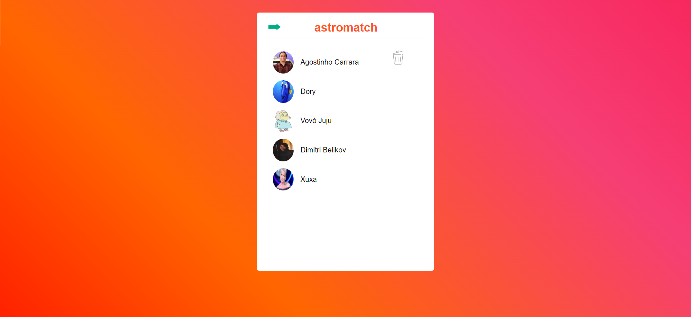

# Astromatch (tinder inspiration)
This exercise was proposed by Labenu, an online programming school.

## Functionalities
* The user can see the main information about the other users: name, age and description;
* The user can tap the heart to like the other user or tap de cross to deslike them;
* When the user likes someone who also like them, they will see the message "It's a match" on the screen;
* The user can see the list of matches and also delete it;
* The project is responsive to all screen sizes.

## Technologies used
* Javascript
* HTML / JSX
* CSS / Styled-components
* React JS

## Link to access the project
[Link surge](https://macabre-bean.surge.sh/)

## Images

